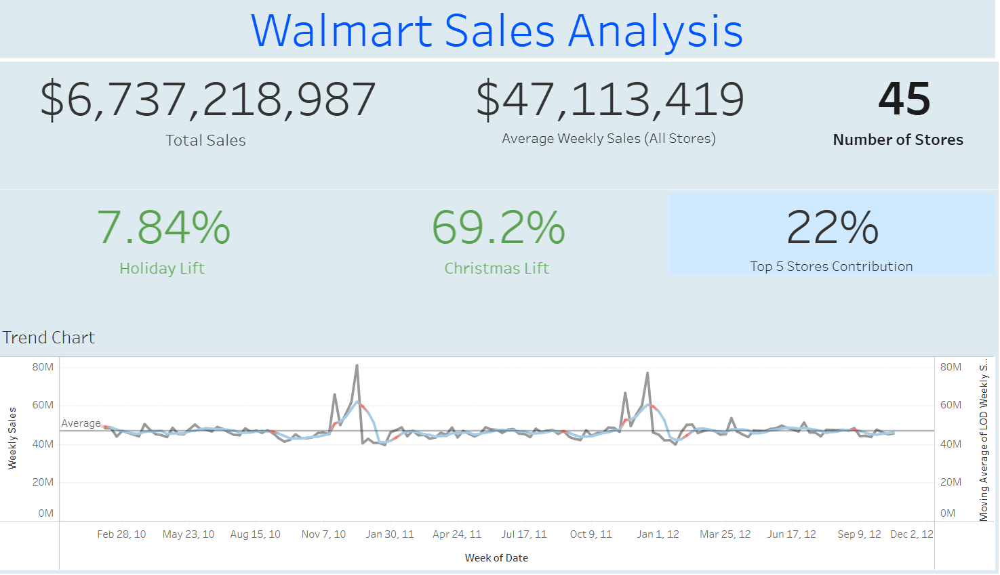

# Walmart Sales & Demand Volatility Analysis

**Author:** Aaron Villegas  
**Tech Stack:** Python (Pandas, Matplotlib), SQL (PostgreSQL), Tableau  

## Executive Summary
This project analyzes two years of weekly sales data across 45 Walmart stores to identify key drivers of revenue, seasonal demand spikes, and store-level volatility. By evaluating the relationship between historical sales and external economic indicators (CPI, fuel prices, unemployment, and temperature), this analysis provides actionable, data-driven recommendations to optimize inventory planning, staffing allocation, and localized sales forecasting.

## 📊 Key Performance Indicators (KPIs)

| Metric | Value |
| :--- | :--- |
| **Total Sales Volume** | $6,737,218,987 |
| **Average Weekly Sales (All Stores)** | $47,113,419 |
| **Average Weekly Sales (Per Store)** | $1,046,965 |
| **Broader Holiday Sales Lift** | +7.84% |
| **Christmas Week Sales Lift** | +69.23% |
| **YoY Growth (2011)** | -0.36% |
| **YoY Growth (2012)** | +2.90% |

---

## 💡 Business Insights & Supply Chain Impact

*   **Seasonal Demand Spikes:** Holiday weeks drive a baseline 7.84% increase in sales, but Christmas week acts as a massive outlier, generating a **69.23% revenue lift** compared to non-holiday weeks. 
*   **Revenue Concentration:** Sales are heavily skewed, with the top 5 performing stores (Stores 20, 4, 14, 13, and 2) generating **22% of total revenue**.
*   **Store-Level Volatility (Risk Assessment):** Measured using the Coefficient of Variation (CV) rather than standard deviation to account for store size differences. Stores 35, 7, 15, 29, and 23 exhibited the highest relative volatility, representing higher risk for overstock or stockouts.
*   **Local Economic Sensitivity:** Across the entire network, external factors (Temp, Fuel, CPI, Unemployment) showed near-zero linear correlation with sales. However, isolating the data by store revealed that specific locations are highly sensitive to these external factors, indicating that broad national models are insufficient for accurate local forecasting.

## 🎯 Actionable Recommendations

1.  **Dynamic Inventory Allocation:** Transition highly volatile stores (highest CV/variance) to a more flexible inventory strategy to lower risks of low stock, while keeping fixed inventory models for the most consistent stores (Stores 31, 44, 43, 30, and 37).
2.  **Localized Forecasting Models:** Shift away from national macroeconomic forecasting. Incorporate store-specific weather and economic data into localized machine learning models to improve week-over-week demand prediction accuracy.

---

## 🛠 Data Processing & Methodology

*   **Data Pipeline:** Queried a PostgreSQL database containing ~6,400 weekly sales records using custom Python ETL loader scripts.
*   **Data Cleaning:** Verified data integrity by checking for nulls and duplicate entries across store/date primary keys.
*   **Feature Engineering:** Created Boolean flags for specific holiday periods (e.g., isolating December 19-25 for Christmas impact) and calculated rolling averages to smooth out noise and visualize macro trends.
*   **Statistical Analysis:** Evaluated store risk using Standard Deviation and Coefficient of Variation (CV). Conducted Pearson correlation analysis between weekly revenue and external economic features.

## 🖥 Tableau Dashboard

[Click here to view the interactive Tableau Dashboard](#)
